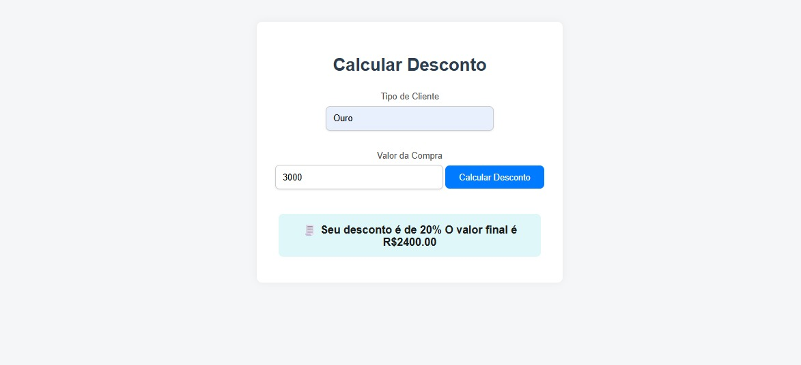

# 💸 Sistema de Desconto por Categoria de Cliente

Este projeto é uma aplicação simples que calcula o desconto aplicado com base na categoria do cliente (Premium, Ouro ou Prata) e no valor da compra.

## 📷 Demonstração



👉 [Acesse o projeto online](https://analiceferreirads1.github.io/sistema-de-desconto/)

---

## 🚀 Funcionalidades

- Inserção da categoria do cliente.
- Inserção do valor da compra.
- Cálculo automático do desconto.
- Exibição do valor final com desconto.
- Interface simples, clara e responsiva.

---

## 🛠️ Tecnologias Utilizadas

- **HTML5**: Estrutura da página, como títulos, botões e entradas.
- **CSS3**: Estiliza a página, deixando ela bonita e agradável.
- **JavaScript**: Adiciona a funcionalidade de cálculo do desconto e interação com o usuário.

---

## 🧠 Aprendizados

- Manipulação do DOM: Aprendi como interagir com os elementos da página (como botões e entradas de texto).
- Eventos em JavaScript: Aprendi como capturar ações do usuário, como cliques e mudanças de valor.
- Lógica de condições e cálculos: Aprendi a lógica por trás dos descontos, dependendo da categoria do cliente.
- Estilização com CSS moderno: Usei recursos como box-shadow, border-radius e responsividade para melhorar a aparência e usabilidade.
- Publicação com GitHub Pages: Aprendi como publicar meu projeto na web de forma gratuita.

---

## 🖥️ Como executar localmente

```bash
# Clone o repositório
git clone https://github.com/analiceferreirads1/sistema-de-desconto.git

# Acesse a pasta do projeto
cd sistema-de-desconto

# Abra o arquivo index.html no navegador
📁 Estrutura de Arquivos
sistema-de-desconto/
│
├── index.html
├── style.css
├── script.js
├── README.md
└── screenshot.png
📌 Status do Projeto

✅ Projeto finalizado e publicado!
👩‍💻 Autora

Desenvolvido por Analice Ferreira

🔗 [LinkedIn] www.linkedin.com/in/analiceferreirads